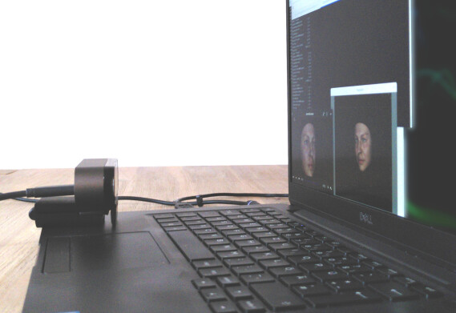

# Installation of the OVMF

We provide two ways of installing OVMF on your computer:

1. [Easy method](#easy-installation-for-windows): Step-by-step installation that uses a binary package created by us. This method works with Windows only. 

2. [Advanced method](#advanced-installation): Advanced installation including preparation of Blender and compilation of OpenFace. This works for Windows and Linux systems.

In the ned of this document, you find some information on [setting up your webcam](#3-webcam-setup) and [calibration of the system's end-to-end latency](#4-latency-calibration).

# 1. Easy Installation for Windows

Please follow the instructions step-by-step.
## 1.1 Install software libraries

If not installed on your system, please download and install the following packages.

- [Microsoft VC Runtime Libraries (16)](https://aka.ms/vs/16/release/vc_redist.x64.exe).
- [Miniconda 64-Bit](https://repo.anaconda.com/miniconda/Miniconda3-latest-Windows-x86_64.exe).
Alternatively, you can use full [Anaconda 64-Bit](https://www.anaconda.com/download/). 
For more information check [this guide](https://docs.conda.io/projects/conda/en/latest/user-guide/install/index.html).

## 1.2 Setup Conda environment

Open the `Anaconda Prompt` from the start menu. It will typically open in your user's home directory, e.g., `c:\Users\mgrewe`. You can change to a different directory or just install the OVMF there. 

To prepare and activate a conda environment, type the following lines into the `Anaconda Prompt`:

    conda create -n ovmf python=3.9
    conda activate ovmf
    conda install git git-lfs

## 1.3 Clone OVMF repository

Now, clone the git repository by execution of:

    git clone https://github.com/mgrewe/ovmf.git

## 1.4 Update Conda environment

Install required libraries with:

    cd ovmf
    conda env update -f .\environment.yml -n ovmf

## 1.5 Download Blender/OpenFace package

Download the [ZIP package](https://cloud.zib.de/s/tqTmrgP9LfDqSKG/download/Blender_OpenFace_Binary_Package_1.zip) and extract it into `ovmf\contrib`. 
It should now contain two directories, i.e., `Blender`  and `OpenFace`.

## 1.6 Start OVMF

Now, everything should be readily prepared such that you can start the OVMF via:

    python start.py -p example

The OVMF should start a Blender and a PsychoPy window showing an example scene like this

Learn how to obtain the FexMM avatars [here](README.md#ovmf-avatars).

# 2. Advanced Installation

This walk-through installation will show you how to set up the OVMF with an original version of Blender and the source code of OpenFace.
This method has been tested on Windows and Linux.

## 2.1 Install compiler and build tools

We will now set up a working build tool chain for the compilation of OpenFace.

### Windows

Download and run [Visual Studio 2019 Build Tools](https://aka.ms/vs/16/release/vs_buildtools.exe). 
Select `Desktop Development with C++` and then at least `MSVCv142 - VS 2019 C++ x64/x86 build tools` and `Windows 10 SDK` for installation.
For more information check [this guide](https://wiki.python.org/moin/WindowsCompilers).

### Linux
Install the essential build tools. 
E.g., in Ubuntu simply run:

    sudo apt-get install build-essential

## 2.2 Install Conda

Download and install [Miniconda 64-Bit](https://repo.anaconda.com/miniconda/Miniconda3-latest-Windows-x86_64.exe).
Alternatively, you can use full [Anaconda 64-Bit](https://www.anaconda.com/download/). 
For more information check [this guide](https://docs.conda.io/projects/conda/en/latest/user-guide/install/index.html).

## 2.3 Setup Conda environment and clone OVMF repository

Create a Conda environment for the OVMF and activate it:

    conda create -n ovmf
    conda activate ovmf

If necessary, install git, git-lfs, and curl:

    conda install git git-lfs curl

Recursively clone the repository and its submodules:

    git clone --recurse-submodules https://github.com/mgrewe/ovmf.git
    cd ovmf

Install the required libraries in the conda environment. 
We also installed PsychoPy such that we can start the experiments directly with the OVMF. 
If it is not needed, you can remove the line from the `ovmf/environment.yml`.
Then run:

    conda env update -f environment.yml

## 2.4 Configure and build OpenFace

Download pretrained detector models (In `Anaconda Powershell Prompt`, you need to write `curl.exe`):

    curl -L https://www.dropbox.com/s/7na5qsjzz8yfoer/cen_patches_0.25_of.dat -o contrib/OpenFace/lib/local/LandmarkDetector/model/patch_experts/cen_patches_0.25_of.dat

    curl -L https://www.dropbox.com/s/7na5qsjzz8yfoer/cen_patches_0.35_of.dat -o contrib/OpenFace/lib/local/LandmarkDetector/model/patch_experts/cen_patches_0.35_of.dat

    curl -L https://www.dropbox.com/s/7na5qsjzz8yfoer/cen_patches_0.50_of.dat -o contrib/OpenFace/lib/local/LandmarkDetector/model/patch_experts/cen_patches_0.50_of.dat

    curl -L https://www.dropbox.com/s/7na5qsjzz8yfoer/cen_patches_1.00_of.dat -o contrib/OpenFace/lib/local/LandmarkDetector/model/patch_experts/cen_patches_1.00_of.dat

Make sure do download the model files before the build such that they can be copied to the correct locations.
Then, configure and build Openface:

    cd contrib/OpenFace
    mkdir build 
    cd build
    cmake -DCMAKE_BUILD_TYPE=Release ..
    cmake --build . --config Release --parallel 4 --target FeatureExtractionPython
    cd ../../..

## 2.5 Install Blender
Download the portable version of [Blender](https://www.blender.org/download/).
Preferably, extract and move the files into the `ovmf/contrib/Blender` directory.

Blender comes with its own Python distribution. 
We need to manually install `pyzmq` for the communication with the OVMF.
This can be done by opening a terminal in the Blender directory and executing the following lines provided that the version is changed accordingly:

### Windows

    .\contrib\Blender/3.0\python\bin\python.exe -m pip install -U pip
    .\contrib\Blender/3.0\python\bin\python.exe -m pip install pyzmq

### Linux

    ./contrib/Blender/3.0/python/bin/python3.9 -m pip install -U pip
    ./contrib/Blender/3.0/python/bin/python3.9 -m pip install pyzmq

## 2.6 Configure OVMF

OVMF needs to know the location of Blender and OpenFace. 
Adjust the paths in `ovmf/config/contrib.json` accordingly.
Below the OVMF directory, relative paths can be used, e.g.,

    {
        "blender_executable": "contrib/Blender/blender",
        "openface_binary_dir": "contrib/OpenFace/build/bin/",
        "openface_model_au_root_dir": "contrib/OpenFace/build/bin/"
    }

## 2.7 Start OVMF

Now, everything should be setup. Run the example as described [here](#16-start-ovmf).

# 3. Webcam Setup

The configuration of the webcam is of great importance. 
The camera's parameters significantly effect the end-to-end latency and the tracking performance. 
For a well-working setup, it might be necessary to tune the parameters of the specific hardware and lab environment.

Most webcams, like the Logitech Brio used in our experiments, allow the user to control various parameters. 
However, the number of parameters and the interpretation of the values may vary between vendors and models. 
Please refer to the documentation of your webcam for more details.

We are currently working on adjustment of common parameters via the configuration files.
Please have a look at the `webcam_input` section in [config/modules.json](config/modules.json) for currently supported parameters.

## Exposure Time

One major parameter is the camera's exposure time, i.e., the time that is needed to capture an image. 
The smaller it is, the lower the latency becomes.

Linux users can use the command line tool `v4l2-ctl` for adjustment of most parameters during operation of the webcam.
E.g., set exposure mode to manual and adjust the absolute time via

    v4l2-ctl -d /dev/video0 -c auto_exposure=1 
    v4l2-ctl -d /dev/video0 -c exposure_time_absolute=25

## Brightness and Contrast

Adjustment of the exposure time also affects the brightness and the signal-to-noise ratio of the images.
Short exposure times make the image appear darker.
Most cameras allow to increase the gain (similar to the ISO setting of DSLRs), but the resulting images might be too noisy.
You need to find a good compromise between exposure time and image quality.

Under Linux, you can try to play with gain, brightness, contrast, or other parameters, e.g.,

    v4l2-ctl -d /dev/video0 -c gain=150
    v4l2-ctl -d /dev/video0 -c brightness=200 
    v4l2-ctl -d /dev/video0 -c contrast=128

## Autofocus

Many cameras have an autofocus function. 
It continuously adjusts the focus to maintain sharpness as the distance of the face to the camera changes. 
In a lab setting, participants usually have a constant distance to the camera which allows to disable the feature. 
This may reduce latency and avoid tracking problems when the re-focussing procedure causes blurry images.

The focus and zoom can be set by

    v4l2-ctl -d /dev/video0 -c focus_automatic_continuous=0
    v4l2-ctl -d /dev/video0 -c focus_absolute=50 
    v4l2-ctl -d /dev/video0 -c zoom_absolute=100
    

## Other parameters

Other parameters of webcams include automatic white balance, backlight compensation, etc.

You can get a full list of the parameters using

    v4l2-ctl -d /dev/video0 --all

# 4. Latency Calibration

We provide a method for calibrating the end-to-end latency of the OVMF.
The method is described in detail in our [paper](README.md#the-open-virtual-mirror-framework-ovmf).
The Jupyter notebook can be found [Jupyter notebook](./latency_calibration/end-to-end-latency.ipynb).

The steps of the calibration procedure are:

1. A video of an avatar doing a head turn as [here](./latency_calibration/head_turn.mp4) is prerecorded and continuously replayed.

2. The video is captured by the webcam which is used by the OVMF such that the tracked movements are transferred to a second avatar which is displayed on the screen, e.g., within PsychoPy.
An example calibration pipeline can be found [here](config/pipelines/latency_calibration.json). 
It can be started with `python start.py -p latency_calibration`. 
You may use your own experimental pipeline.

3. Both avatars are displayed next to each other. Make sure that the webcam used by the OVMF only captures the prerecorded video, similar to the setup above.

4. A second camera is used to record both avatars, e.g., with an Android mobile phone with OpenCamera, available via the [Playstore](https://play.google.com/store/apps/details?id=net.sourceforge.opencamera&hl=de&gl=US) or [F-droid](https://f-droid.org/en/packages/net.sourceforge.opencamera/). Make sure to use a high frame rate.

5. Use the [OpenFace Toolkit](https://github.com/TadasBaltrusaitis/OpenFace/) to automatically track the poses of the two faces. 
    This can be done using the command line tool

                FaceLandmarkVidMulti -f <filename>.mp4
                
    It will generate a csv (normally in a subfolder called *processed*) which can be read by this script.

6. Adjust the path in the notebook's parameter section to point to the csv file and run the cells. 
Note that you may need to correct face ids which were assigned by OpenFace.

