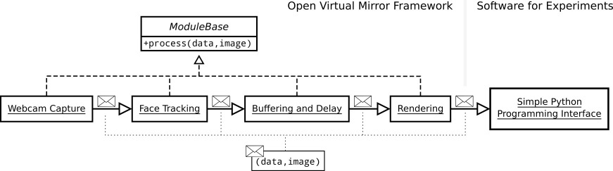

# The Open Virtual Mirror Framework (OVMF)


The Open Virtual Mirror Framework (OVMF) is a toolbox for virtual mirror experiments developed by the [Computational Diagnosis and Therapy Planning Group](https://www.zib.de/visual/therapy-planning) at Zuse Institute Berlin.
It is mainly intended for psychological research on enfacement and beyond.
The OVMF can track a large range of facial movements, including head pose and facial expressions.
The tracked movements can be manipulated on-the-fly and used to animate realistic avatar faces.


Our goal is to make the usage of the OVMF as simple as possible.

- The OVMF can run on standard computer hardware with a low latency.
- It interfaces with existing software for psychological experimentation like PsychoPy.
- The OVMF can be easily extended for the implementation of a large range of experimental paradigms.
- It facilitates creation of a tightly controlled experimental setup.


The OVMF and third party software (e.g., [OpenFace](https://github.com/TadasBaltrusaitis/OpenFace/) and [Blender](https://www.blender.org/)) are open source.
This fosters sustainability, extensibility, and replicability of enfacement research.
A detailed description of the OVMF can be found in our BRM paper. Please cite it if you are using our work. 

> Grewe, C.M., Liu, T., Hildebrandt, A., & Zachow, S. *The Open Virtual Mirror Framework for enfacement illusions. Enhancing the sense of agency with avatars that imitate facial expressions.* Behavior Research Methods (2022) https://doi.org/10.3758/s13428-021-01761-9


The OVMF has been established by the project [EMOTIC](http://www.activeself.de/emotic-enfacement-manipulation-in-transmitted-inter-facial-communication/).
It will be further developed in the project [The Cognitive Control of Social Resonance](http://www.activeself.de/the-cognitive-control-of-social-resonance/).
Both projects are part of the Special Priority Programme [The Active Self](http://www.activeself.de/) which is funded by the German Research Foundation.


# Installation

We originally developed the OVMF for the Linux and Windows operating systems, but it should be simply possible to use it on Mac as well.
Please refer to the [installation instructions](./INSTALLATION.md).


# Usage

You can run the example pipeline of the OVMF by running the following command in the conda environment.

    python start.py -p example

This launches the OVMF modules in the example pipeline, including a preview window showing the tracked landmarks, a Blender window, and a PsychpPy window. 
During an experiment, you can simply minimize the Blender window.
Note that the size of the 3D view in the Blender window determines the resolution of the rendered image.
Rendering of larger images will increase the latency (see also [latency calibration](INSTALLATION.md#4-latency-calibration)).

## Pipelines

The OVMF has a modular design, i.e., its functionality is implemented across multiple modules which can be flexibly combined.
We call such a combination of modules a *pipeline*.
Each pipeline specifies how messages are passed between modules.



A message contains an image and additional data associated to it, e.g., the parameters of the tracked movements.
Messages are passed form the initial to the last module in feed-forward fashion.

The modules operate in parallel so that different messages can be processed simultaneously. 
For instance, face tracking can be performed for a new webcam image while a previous frame is still being processed for the animation and rendering of the avatar.

## Pipeline Configuration

A pipeline is configured in a JSON file located in `config/pipelines`.
The file has a simple format:

```json
{
	"webcam_input": {
	},
	"openface_tracker": {
        "send_image": false,
		"receive":{
            "image_data": "webcam_input"
		}
	},
    "image_preview": {
        "receive":{
            "image_data": "webcam_input",
            "tracker_parameters": "openface_tracker"
        }
    },
	"delay": {
		"receive":{
			"tracker_parameters": "openface_tracker"
		}
	},
	"openface_to_fexmm_remapper": {
		"receive" : {
			"tracker_parameters": "delay"
		}
	},
	"blender_renderer": {
		"blend": "data/fexmm_avg_face.blend",
		"init": "modules/blender_renderer/blender_avatar.py",
		"receive": {
			"fexmm_parameters": "openface_to_fexmm_remapper"
		}
	}
}
```

This pipeline contains the 6 modules of a simple virtual mirror experiment, i.e., (1) webcam capture, (2) face tracking, (3) image preview, (4) delay, (5) parameter remapping, (6) rendering.
The first value determines the type of module, e.g., `webcam_input`.

Each module receives data from previous modules through input channels as specified in the `receive` array. 
A module can have multiple input channels as in the `image_preview`.
Each channel has a name, e.g., `image_data`, and the name of the previous module, e.g., `webcam_input`.

Each module can be configured with additional parameters.
For instance, `send_image` specifies whether the webcam image is forwarded to subsequent modules. 
Setting this parameter to `false` saves time and reduces latency, but later modules will not be able to process the webcam image.
In the example above, modules after `openface_tracker` only process the tracked parameters such that the image can be safely discarded.

An overview about the modules and parameters is given in [`config/modules.json`](config/modules.json).

## PsychoPy Experiment

For convenience, the OVMF provides a [Python interface](modules/external/ovmf.py). 
It can be used from many toolboxes for psychological experimentation such as PsychoPy or OpenSesame.
Here is an example code of how OVMF can be integrated into a PsychoPy experiment.


```python
from psychopy import visual, core
import ovmf

# Create the virtual mirror interface
vm_interface = ovmf.Interface()
# Set 5 seconds delay
vm_interface.set_delay(0)

# Create PsychoPy window and image stimulus
win = visual.Window(
    size=[1088, 728],
    units="pix",
    fullscr=False,
    gammaErrorPolicy = 'ignore',
    waitBlanking=False)
img = visual.ImageStim(win, units = 'pix')
img.size = [640, 480]
img.setAutoDraw(True)

# Run forever
while True:
    # Receive and set image
    vm_interface.receive_and_set_image(img)
    win.flip()
```

PsychoPy can be started as a module directly by the OVMF (see [modules/external/psychopy_example.py](modules/external/psychopy_example.py)).
Alternatively, the OVMF can also be started in the background while a separate PsychoPy session is used for every participant (see [modules/external/psychopy_example_standalone.py](modules/external/psychopy_example_standalone.py)).

## Extension

Example module for expression amplification/attenuation

# Contribution

You are warlmy welcome to contribute by sending pull requests or other improvements to us.
Please also have a look at the list of [TODOs](TODO.md).

# OVMF Avatars

The avatars used in our evaluation study of the OVMF were created with our 3D Facial Expression Morphable (FexMM).
The FexMM may only be used for scientific purposes.
To obtain the avatars, please read and sign the [license agreement](data/fexmm_license_agreement.pdf) and send it to us.


More details on the FexMM can be found here:

> Grewe, C.M., Liu, T., Kahl, C.A., Hildebrandt, A., & Zachow, S. Statistical Learning of Facial Expressions Improves Realism of Animated Avatar Faces. Frontiers in Virtual Reality (2021) https://doi.org/10.3389/frvir.2021.619811


